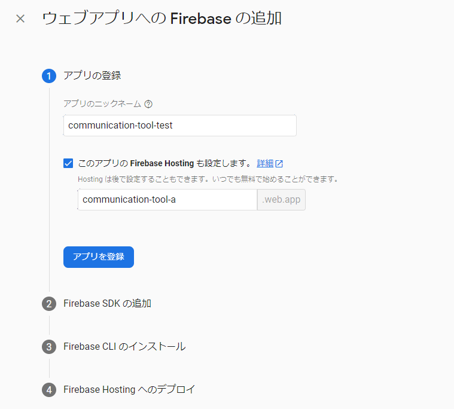
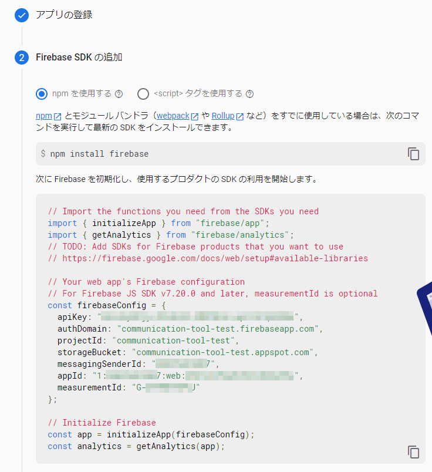

# communication-tool OSS
シタテルの社内コミュニケーションアプリです。

# 使用方法

## 要件
- Firebaseプロジェクトにアクセスできること
- Node.js 14, yarn
  - [volta](https://volta.sh/) があると便利です

## 準備
1. [Firebase console](https://console.firebase.google.com/)で新しいプロジェクトを作成します。
1. 作成したプロジェクトに ["ウェブ"のアプリを追加](https://firebase.google.com/docs/web/setup?hl=ja)
1. hostingを有効にして進めていきます。
   
1. `firebaseConfig` をコピーします。
   
1. プロジェクトでauthを有効化、ログインプロバイダを設定
1. プロジェクトでfirestoreを有効化
1. プロジェクトでstorageを有効化

## ローカルで実行
1. [volta](https://volta.sh/) をinstallします。
1. `cp src/sample.config.ts src/config.ts`
1. `src/config` のfirebaseConfigを先ほどコピーした値に書き換えます。
1. 実行
    ```shell
    yarn
    yarn serve
    ```

### Firebaseエミュレータを使用する場合
```shell
firebase emulators:start
yarn serve:emulator
```

## デプロイ
1. [Firebase CLI をインストール](https://firebase.google.com/docs/cli?hl=ja#install_the_firebase_cli)
1. CLIの設定
    ```shell
    firebase login
    firebase projects:list
    firebase use <project_id>
    ```
1. ビルド
    ```shell
    yarn build
    ```
1. Fireaseへデプロイ
    ```shell
    yarn run firebase deploy
    ```

## 使用フレームワーク / ライブラリ
- [Vue3](https://v3.vuejs.org/)
- [vue-router](https://router.vuejs.org/ja/)
- [tailwindcss](https://tailwindcss.com/)
- [firebase](https://firebase.google.com/docs/web/setup)

